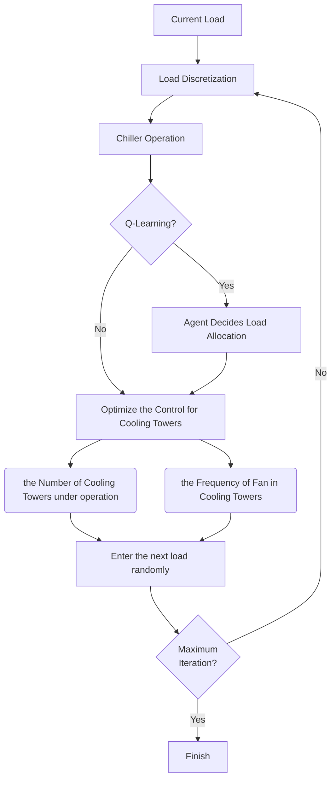

# 1. What is it for

This is a simple example of how to train agent for building energy efficiency in virtual environment without the help of other external software, like [fmi](https://fmi-standard.org/) or [OpenModelica](https://openmodelica.org/). If you are interested in how research crowd do similar things, I write a [blog](https://carrybio.netlify.app/posts/blog12/) to summarize it briefly.

# 2. What does it have

In my example, to make it comprehensive, model-based and model-free are in this example. Model-free is to do load allocation by Q-learning. Model-based is to control the number of cooling towers and frequency of fans in them.  

For every load, model-free is followed by model-based (load allocation first and then cooling tower control). 

In model-free method, reward is about total COP ($COP_{total}=\frac{load}{P_{chillers}+P_{pumps}+P_{towers}}$). that will be independent of any RL relevant package. In model-based method, goal the minimum of total energy consumption.

# 3. Configuration

The virtual system is a classical water system (chillers + water pumps + cooling towers).

| Category | Details                                                                                                                                                                                                                                                                                                                                                                              |
| -------- | ------------------------------------------------------------------------------------------------------------------------------------------------------------------------------------------------------------------------------------------------------------------------------------------------------------------------------------------------------------------------------------ |
| Chillers | Chiller#1: with larger capacity, two chillers in total Chiller#2: with smaller capacity, one chiller. (details in .ipynb 7. subfunction)                                                                                                                                                                                                                                         |
| Pumps    | Chilled Water Pump#1: with more nominal waterflow in nameplate Fixed Freq, two pumps in total Chilled Water Pump#2: with less nominal waterflow in nameplate Fixed Freq, one pump Cooling Water Pump#1: with more nominal waterflow in nameplate Fixed Freq, two pumps in total Cooling Water Pump#2: with less nominal waterflow in nameplate Fixed Freq, one pump  |
| Tower    | All Cooling Towers are idential, with variable-speed fans                                                                                                                                                                                                                                                                                                                            |

# 4. Hard Things to Solve

## 4.1 Decoupling

Chillers are nexus of two water loops. Cooling water will go through cooling towers and chillers so that the temperature will be affected by these two components. You can calculate temperatures of cooling water from two perspectives. Theoretically you can get the same result from two sides. One perspective is chiller and law of energy conversion. The amount of heat transfer in chilled water loop should equal that in cooling water loop. Other persepctive is cooling tower. $T_{cwl}=f_{tower}(\triangle t,t_{wb},...)$. where $\triangle t$ is the difference between temperature of water entering and leaving tower ($T_{cwl}$), $t_{wb}$ is the wet bulb temperature of ambient air. $\triangle t$ needs both key temperatures simultaneously. You need iteration or other methods to get result converged. If you wanna explore more details about the cooling tower perspective, you can check [EngineeringReference](https://github.com/Hurricane-k/BuildingEfficiencyAgent_in_VirtualEnv/blob/main/EngineeringReference.pdf), I put pdf format file in repository. I annotate it in .ipynb file. I use iteration to solve this decoupling problem, for the sake of efficiency, I set the maximum iteration. (`8.8 calculate the temperature of cooling water entering cooling tower` in .ipynb)

## 4.2 Solve $T_{cwl}$ from the persepctive of cooling tower

To simplify, I use loop method instead of some methods to get converged results, which means cannot make sure the ultimate result $t_{cwl}$ would be definitely converged. I will generate several temperatures as candidates to see their residual. and choose the best candidate based on the minimum residual. (`1.1 calculating outlet water temperature`)

# 5. Simplify some components

Our focus on chillers can cooling towers makes us simplify water pumps. All water pumps are not variable-speed, they are with fixed frequency 50Hz. You can get my meaning in `2 Cooling Water Pump`

# 6. Structure of .ipynb

1. `1 Cooling Tower` includes cooling tower models and how to calculate $T_{cwl}$ from the perspective of cooling towers, the model of fan power is simple cubic formula, which is based on real equipment, you can change it if necessary.
  
2. `2 Cooling Water Pump` includes models of power (electricity consumption) and watetflow
  
3. `3 Chilled Water Pump` is the same as 2
  
4. `4 Chiller` includes two kinds of chillers mentioned in table. How to calculate the COP, chiller model are from EnergyPlus database.
  
5. In `7 subfunction`, `7.2`presents chiller operation, how many chillers we need to operate to deal with load, which can determine pump operation. Noticably, for sake of energy-saving, we set `T_chwe` is 12 Celsius.
  
6. `8.1 initialization` includes two parts, generating intial Q-table, and parameters of reward calculation.
  
7. `8.3` explains the situation when we need to use Q-learning to allocate load, if we need smaller and larger chillers, we need to use Q-learning. Otherwise don't use Q-learning.
  
8. `8.4 discretization` is for Q-Table, Q-Table needs discretization.
  
9. `8.6` calculate the temperature of main water leaving chillers because some difference between $T_{chwl}$ of smaller and larger chillers.
  
10. `8.9` is how to choose the optimal control set (for cooling towers) using model-based method after using Q-learning load allocation. But one thing needs to notice, model-based optimization for cooling tower control is necessary, whether Q-learning is used or not for every load.
  

# 7. Other Notice

The table structure is the column is action, 0.1, 0.15, 0.2, ... 1.0 (for load allocation for smaller chiller), for example, when $action = 0.5$, the load that smaller chiller deals with $0.5*Capacity_{nominal smaller chiller}$. the row is status, 0.1, 0.15, 0.2, ..., 1.0, we presume the maximum of total load is 7000 kW, the status can be got by $Load_{current}/Load_{maximum}, Load_{maximum}=7000kW$.

# 8. Workflow of the Example

